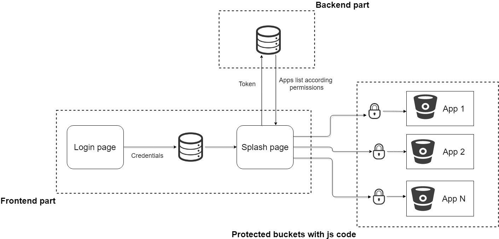

# NxExperiments

## To start project:
* `npm install -g @nrwl/schematics`
* `npm install`

## To serve certain app:
* `ng serve --app=<app-name>`

## To build all apps:
* `npm run build:all`

## To build certain app:
* `ng build --app=<app-name>`

## Architectural vision:

